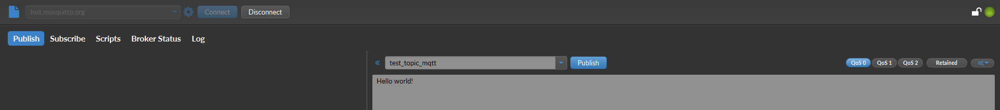
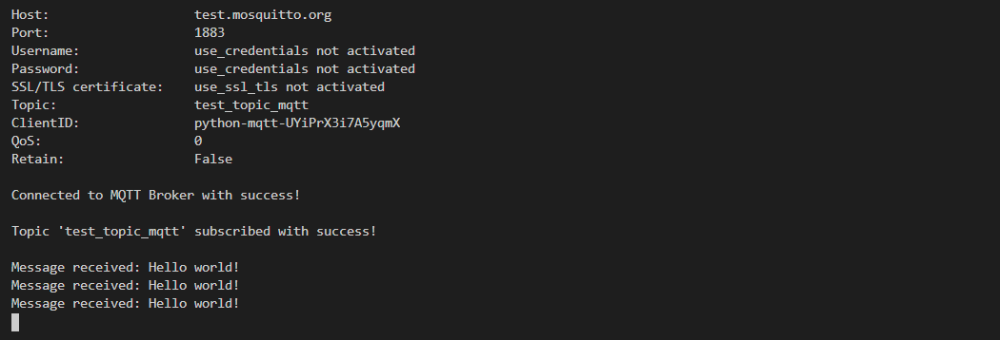
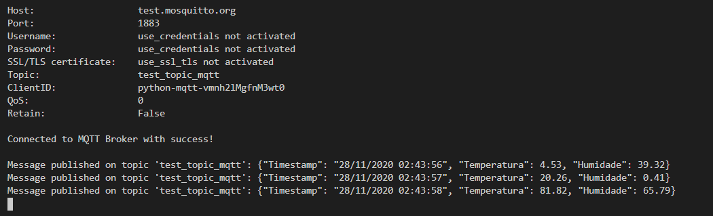
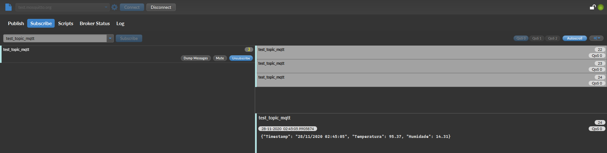

# MQTT Python Client

This repository provides a python script that allows you to both publish and subscribe messages via [MQTT](https://mqtt.org/) using [paho-mqtt](https://pypi.org/project/paho-mqtt/) library.


## Table of Contents
1. [How to install](#howtoinstall)
2. [How to configure](#howtoconfigure)
2. [How to run](#howtorun)
3. [Screenshots](#screenshots)


## How to install <a name="howtoinstall"></a>

```
pip install -r requirements.txt
```


## How to configure <a name="howtoconfigure"></a>

The script configurations can be made in the [Configurations](https://github.com/Jorge-Mendes/python-mqtt/blob/main/mqttPubSub.py#L10-L17) and [Parameters](https://github.com/Jorge-Mendes/python-mqtt/blob/main/mqttPubSub.py#L20-L29) sections of the script.

### [Configurations](https://github.com/Jorge-Mendes/python-mqtt/blob/main/mqttPubSub.py#L10-L17)

| Configuration    | Description                            | Value         |
|------------------|----------------------------------------|---------------|
| use_websockets   | Use websockets                         | True/False    |
| use_ssl_tls      | Use SSL/TLS                            | True/False    |
| use_credentials  | Use credentials to connect to the host | True/False    |
| use_debug_log    | Activate debug log                     | True/False    |
| subscribe_topic  | Activate topic subscription            | True/False    |
| publish_message  | Activate message publication           | True/False    |
| publish_interval | Publish message interval (in seconds)  | Integer       |

### [Parameters](https://github.com/Jorge-Mendes/python-mqtt/blob/main/mqttPubSub.py#L20-L29)

| Parameter               | Description                            | Value      |
|-------------------------|----------------------------------------|------------|
| mqtt_host               | MQTT broker host                       | URL        |
| mqtt_port               | MQTT broker port                       | Integer    |
| mqtt_username           | MQTT broker username                   | String     |
| mqtt_password           | MQTT broker password                   | String     |
| mqtt_certificate_path   | SSL/TLS certificate                    | CRT File   |
| mqtt_topic              | MQTT broker topic                      | String     |
| mqtt_qos                | Quality of Service (0, 1 or 2)         | Integer    |
| mqtt_retain             | Retained Messages                      | True/False |
| mqtt_keepalive_interval | Keep the connection alive (in seconds) | Integer    |


## How to run <a name="howtorun"></a>

```
python mqttPubSub.py
```


## Screenshots <a name="screenshots"></a>

### Subscribe




### Publish



